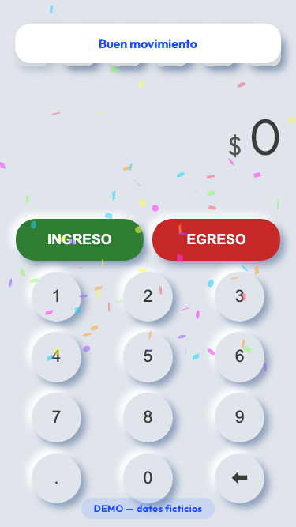

# Finanzas Emprendimiento/Hogar

Aplicación web de finanzas personales con interfaz neumórfica y teclado numérico integrado, diseñada para registrar ingresos y egresos con sincronización a Google Sheets.

  

> **La demo abre con datos ficticios y categorías genéricas.** Sin backend
> configurado la app funciona entera en modo local, así que se puede probar sin
> conectar nada.

## Stack

- **HTML5 / CSS3** — Interfaz single-page con diseño neumórfico responsive
- **JavaScript** (vanilla) — Lógica de la aplicación sin frameworks
- **Chart.js** — Gráficos de evolución y tendencias financieras
- **Google Apps Script** — Backend para persistencia de datos en Google Sheets
- **localStorage** — Caché local para funcionamiento offline
- **canvas-confetti** — Animaciones de feedback visual

## Funcionalidades

- Registro de ingresos y egresos con teclado numérico tipo calculadora
- Visualización del saldo actual en tiempo real
- Historial de transacciones con filtros
- Gráficos de evolución y tendencias (Chart.js)
- Sincronización con Google Sheets como base de datos
- Caché local para acceso offline
- Vistas separadas: Hogar, Mar de Pan, Evolución e Histórico
- Diseño mobile-first con estética neumórfica

## Demo

[Ver demo en vivo](https://martinlleral.github.io/finanzas-v6)

## Autor

Martín Lleral - [GitHub](https://github.com/martinlleral)
